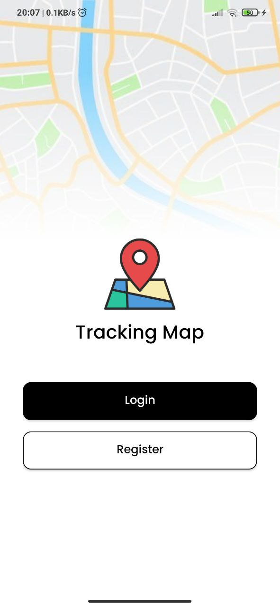
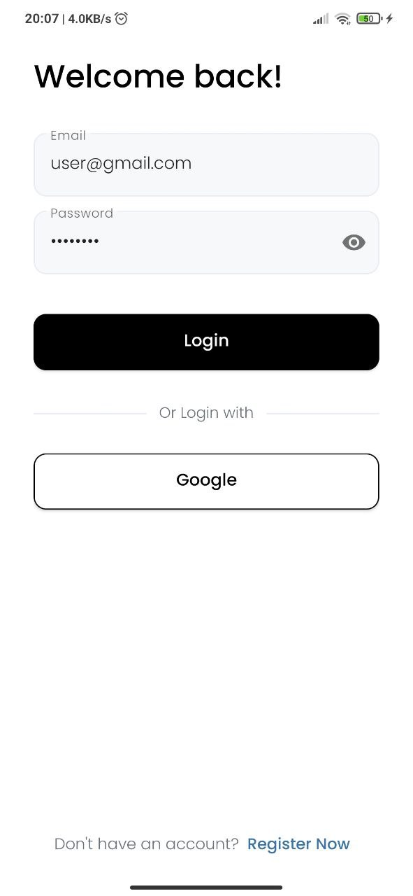
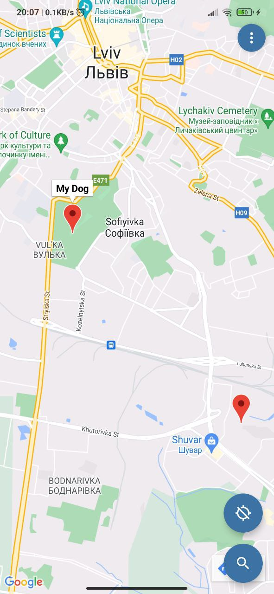
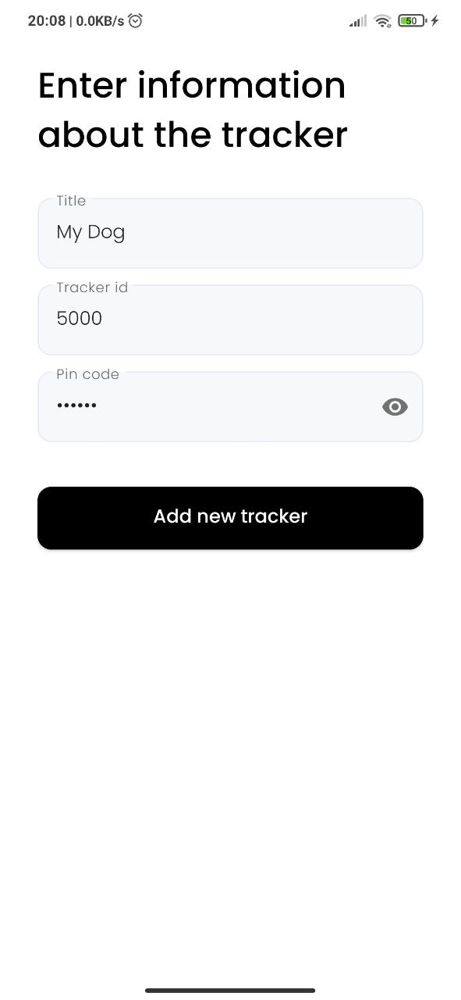

# Tracking Map
There is the android app written on Java for tracking the location of personal belongings. Tracking  is carried out using special devices (_under development_)

## Implementation
### Tools
* Firebase Auth
* Firebase Database
* Play Services Maps

## Usage
### Authorization
You need to authorize to get started. You can do it in 2 ways:
* by email & password. To create an account, enter your email and password on the `Register` page. Then you'll get a letter with confirmation link. If you already have an account, you'll need to login with your credentials on the `Login`page.
* by Google account. Click on the button "Google" on the `Login` or `Register` page and choose your google account

 

### Map
After buying a new tracker device, you should go to `⋮ -> Add new tracker` and enter information about it.
On the map is marked location of your trackers (_red markers_), which are moving in real-time. Also on the map is marked location of your phone if gps is enabled.
When you click on the search button, you'll see the current location of the chosen tracker.

 

## Authors
* [Victoriya Roi](https://github.com/VictoriyaRoy) - App
* [Bohdan Ivashko](https://github.com/bohdaholas) - Embedded
